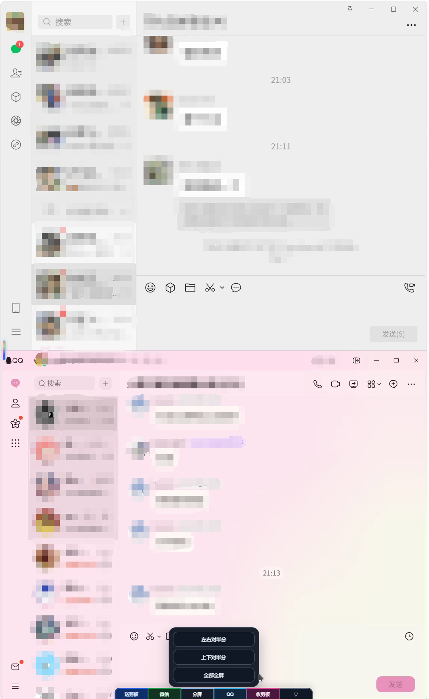

# WeChat Selkies AXiVer

基于 Docker 的微信 / QQ Linux 远程桌面镜像，通过 Selkies WebRTC 在浏览器中使用容器内的微信和 QQ。

当前维护分支：`AXiVer`

## 界面截图



## 主要功能

- 浏览器访问微信 / QQ，无需在本机安装客户端。
- 数据持久化到 `/config`，便于迁移和升级。
- 支持中文字体、本地输入、图片剪贴板、文件传输。
- 支持 AMD64 / ARM64 构建。
- 可选 `/dev/dri` 硬件编码，失败时自动回退 CPU。
- 自动启动微信，可选自动启动 QQ。
- 进程看门狗、X11 健康检查、QQ 卡死检测和自动拉起。

## AXiVer 新增功能

- **PIN 接管会话**：设置 `PASSWORD` 后，只有主动输入 PIN 的浏览器会成为唯一活动会话。刷新、睡眠唤醒、WebSocket 自动重连不会抢占当前会话。
- **旧会话强制回 PIN**：新的 PIN 登录成功后，旧 WebSocket 会被关闭并返回 PIN 页面，旧 Cookie 和旧 localStorage 不能绕过登录。
- **左侧侧边栏修复**：恢复 Selkies 原生左侧抽屉按钮，避免误把全屏按钮、分屏按钮或底部 Dock 按钮识别成侧边栏按钮。
- **快捷键**：`Alt + M` 打开 / 关闭左侧侧边栏。
- **视频软恢复优先**：遇到卡流、疑似画面乱块、解码异常时，先重建视频流和编码 pipeline；连续失败后才执行 X11 重修复。
- **底部快捷 Bar**：提供剪贴板、微信、QQ、分屏等常用入口，并支持折叠；收纳后只有三角按钮占用点击区域，其余位置可继续操作远程页面。
- **分屏工具**：支持左右分屏、上下分屏、全部全屏等布局。
- **自动分屏**：可在“妙妙小工具”中持久开启；每次从 PIN 进入或点击浮动 Bar 的分屏按钮时，宽高比超过 `4:3` 会直接左右分屏，低于 `3:4` 会直接上下分屏，阈值范围内（含边界）直接全部全屏；关闭此选项时，浮动 Bar 的分屏按钮仍会弹出布局菜单。
- **图片粘贴增强**：浏览器 `Ctrl + V` 可将图片写入远端剪贴板，并可自动粘贴到聊天输入框。
- **按需剪贴板同步**：不再监听本机剪贴板；`Ctrl+C` / `Ctrl+X` 会先让远端应用复制/剪切，再收取远端剪贴板，`Ctrl+V` 会先把本机剪贴板写入远端再粘贴。远端剪贴板若由应用自身发生变化，也会自动收剪板，并在底部活动提示中显示进度、成功、无变化或失败状态。
- **链接本地打开**：微信 / QQ 内点击链接时，浏览器侧显示确认卡片，可用本机浏览器打开并保留历史。
- **通知穿透**：微信 / QQ 的提醒可同步到浏览器 Notification、页面标题和底部按钮状态。
- **通知中心**：右侧可收纳通知中心集中显示微信、QQ、剪板、系统、工具和链接事件；推流流量统计只保留在顶部带宽摘要，不再刷屏进入历史列表，同类系统级通知会在 1 分钟内合并为最新一条。
- **局域网发现广播**：可在侧边栏【妙妙小工具】中启用 mDNS 广播并设置广播名，供单窗口客户端优先发现局域网地址。
- **动态节流**：浏览器长时间无鼠标键盘交互后，可在低带宽、低帧率或低占用模式之间切换，降低客户端解码、渲染和 NAS 出站带宽压力；JPEG 直接限发送，H.264 会在进入 / 退出不活跃时重启采集以保持编码帧顺序。
- **超低占用内部休眠**：设置 `PASSWORD` 且启用 `SELKIES_CONTAINER_SLEEP=true` 后，空闲时仅保留 nginx、PIN 鉴权和 sleep-manager，微信 / QQ / 桌面 / 推流进程会在容器内部被暂停，CPU、网络、编码器和 GPU 活跃占用接近 0；再次输入 PIN 后快速唤醒。

## 快速开始

### 使用 Release 镜像包

下载最新 Release 中的 `wechat-selkies-1.57.tar` 后导入：

```bash
docker load -i wechat-selkies-1.57.tar
```

启动：

```bash
docker run -d \
  --name wechat-selkies \
  -p 3000:3000 \
  -p 3001:3001 \
  -v ./config:/config \
  --device /dev/dri:/dev/dri \
  -e PASSWORD=1234 \
  --shm-size=1g \
  --restart unless-stopped \
  wechat-selkies:1.57
```

访问：

- HTTP：`http://localhost:3000`
- HTTPS：`https://localhost:3001`

### 使用 docker compose

仓库已包含 `docker-compose.yml`，可直接调整环境变量后启动：

```bash
docker compose up -d
```

仓库内的 Compose 配置会同时启动 `axisnsbox-discovery` 发现 sidecar。该 sidecar 使用 host 网络发布 mDNS，业务容器仍保持 bridge 网络。

常用配置示例：

```yaml
services:
  wechat-selkies:
    image: wechat-selkies:1.57
    container_name: wechat-selkies
    init: true
    ports:
      - "3000:3000"
      - "3001:3001"
    volumes:
      - ./config:/config
    devices:
      - /dev/dri:/dev/dri
    environment:
      - PUID=1000
      - PGID=100
      - TZ=Asia/Shanghai
      - PASSWORD=1234
      - AUTO_START_WECHAT=true
      - AUTO_START_QQ=false
      - SELKIES_SESSION_MODE=pin-takeover
      - CUSTOM_WS_PORT=8081
      - WATCHDOG_AUDIO=true
      - SELKIES_VIDEO_CORRUPTION_WATCHDOG=false
      - SELKIES_ENCODER=x264enc,x264enc-striped,jpeg
      - SELKIES_DEFAULT_ENCODER=x264enc
      - SELKIES_DISABLE_GAMEPAD=true
      - SELKIES_DYNAMIC_THROTTLE=true
      - SELKIES_DYNAMIC_THROTTLE_MODE=idle-low-occupancy
      - SELKIES_DYNAMIC_LOW_LATENCY_FPS=8
      - SELKIES_DYNAMIC_LOW_LATENCY_HOLD_MS=15000
      - SELKIES_ADAPTIVE_SLEEP_IDLE_SECONDS=3600
      - SELKIES_ADAPTIVE_SLEEP_CHECK_SECONDS=5
    mem_reservation: "2g"
    mem_limit: "8g"
    shm_size: "2gb"
    restart: unless-stopped
```

## 重要配置

| 变量名 | 默认值 | 说明 |
| --- | --- | --- |
| `PASSWORD` | 空 | PIN 登录密码；为空时保持无 PIN 兼容模式 |
| `CUSTOM_USER` | 空 | 旧配置兼容字段，PIN 模式下不需要填写 |
| `PUID` | `1000` | 容器用户 ID |
| `PGID` | `100` | 容器用户组 ID |
| `TZ` | `Asia/Shanghai` | 时区 |
| `SELKIES_HTTP_PORT` | `3000` | Compose 发布到宿主机的 HTTP 端口 |
| `SELKIES_HTTPS_PORT` | `3001` | Compose 发布到宿主机的 HTTPS 端口，也是默认广播端口 |
| `SELKIES_LAN_DISCOVERY_DEFAULT_ENABLED` | `false` | 首次运行且尚无持久化设置时是否默认开启局域网广播 |
| `SELKIES_LAN_DISCOVERY_DEFAULT_NAME` | `AXISNSBOX-000` | 首次运行的默认广播名 |
| `SELKIES_LAN_ADVERTISE_ADDRESS` | 自动检测 | 多网卡宿主机可显式指定需要广播的局域网 IPv4 地址 |
| `AUTO_START_WECHAT` | `true` | 自动启动微信 |
| `AUTO_START_QQ` | `false` | 自动启动 QQ |
| `PROCESS_WATCHDOG` | `true` | 启用进程看门狗 |
| `WATCHDOG_INTERVAL` | `10` | 看门狗检查间隔，单位秒 |
| `WATCHDOG_TRAY` | `false` | 是否自动拉起托盘进程 |
| `WATCHDOG_RESTART_WECHAT` | `true` | 微信退出后自动重启 |
| `WATCHDOG_RESTART_QQ` | `true` | QQ 退出后自动重启 |
| `X11_WATCHDOG` | `true` | 启用 X11 健康检查 |
| `X11_WATCHDOG_FAIL_THRESHOLD` | `6` | X11 连续失败后触发恢复的阈值 |
| `SELKIES_SESSION_MODE` | `pin-takeover` | PIN 接管会话模式 |
| `SELKIES_SESSION_STATE_PATH` | `/run/selkies-active-session.json` | 当前活动会话状态文件 |
| `SELKIES_SESSION_AUTH_PORT` | `38082` | 会话校验桥接服务端口 |
| `SELKIES_VIDEO_CORRUPTION_WATCHDOG` | `false` | 启用视频乱块 / 卡流 watchdog；默认关闭，避免推流恢复通知打扰 |
| `SELKIES_VIDEO_SOFT_RECOVER_LIMIT` | `2` | 软恢复失败次数超过后才重修复 X11 |
| `SELKIES_VIDEO_RECOVER_COOLDOWN_MS` | `120000` | 视频恢复冷却时间 |
| `SELKIES_ENABLE_BINARY_CLIPBOARD` | `true` | 启用二进制剪贴板 |
| `SELKIES_PASTE_IMAGE` | `true` | 启用图片粘贴 |
| `SELKIES_PASTE_IMAGE_MAX_SIZE` | `20971520` | 图片粘贴大小上限 |
| `SELKIES_PASTE_IMAGE_AUTO_PASTE` | `true` | 写入远端剪贴板后自动 Ctrl+V |
| `SELKIES_ENCODER` | `x264enc,x264enc-striped,jpeg` | 可选编码器列表 |
| `SELKIES_DEFAULT_ENCODER` | `x264enc` | 默认编码器；`x264enc` 优先 VAAPI，`x264enc-striped` 为 CPU 分片模式 |
| `SELKIES_DEFAULT_FRAMERATE` | `48` | 默认帧率 |
| `SELKIES_DEFAULT_USE_CPU` | `false` | 优先尝试硬件编码，失败时回退 CPU |
| `SELKIES_DEFAULT_H264_STREAMING_MODE` | `true` | 默认开启 H264 streaming mode |
| `SELKIES_DEFAULT_H264_CRF` | `30` | 默认 H264 CRF |
| `SELKIES_DYNAMIC_THROTTLE` | `true` | 启用动态节流；`SELKIES_DYNAMIC_LOW_LATENCY` 仍作为兼容别名 |
| `SELKIES_DYNAMIC_THROTTLE_MODE` | `idle-low-occupancy` | 动态节流模式：`idle-low-bandwidth`、`idle-low-framerate` 或 `idle-low-occupancy` |
| `SELKIES_DYNAMIC_LOW_LATENCY_HOLD_MS` | `15000` | 最后一次交互后多久进入动态节流 |
| `SELKIES_DYNAMIC_LOW_LATENCY_FPS` | `8` | 低帧率模式发送帧率上限，可设置为 `1` 到 `120` |
| `SELKIES_DYNAMIC_LOW_LATENCY_H264_CRF` | `35` | 低带宽侧的 H264 CRF 默认值 |
| `SELKIES_DYNAMIC_LOW_LATENCY_SAMPLE_PERCENT` | `87` | 低带宽采样 / 带宽缩放下限 |
| `SELKIES_ADAPTIVE_SLEEP_IDLE_SECONDS` | `3600` | 自适应休眠默认待机秒数；界面可选 `60`、`900`、`1800`、`2700`、`3600` |
| `SELKIES_ADAPTIVE_SLEEP_CHECK_SECONDS` | `5` | 自适应休眠检查间隔 |
| `SELKIES_AUTO_SPLIT` | `false` | 自动分屏首次默认值；超过 `4:3` / `3:4` 阈值时分屏，阈值内全部全屏；界面修改后写入 `/config/state/notification-bridge.json` 持久保存 |
| `SELKIES_CONTAINER_SLEEP` | `false` | 启用 PIN 驱动的容器内部超低占用休眠；compose 示例中已开启，但只有设置 `PASSWORD` 后才会实际生效 |
| `SELKIES_CONTAINER_SLEEP_IDLE_SECONDS` | `180` | 旧版兜底值；启用自适应休眠后以界面选择的待机时间为准 |
| `SELKIES_CONTAINER_SLEEP_STARTUP_GRACE_SECONDS` | `180` | 容器启动后多久以内不进入内部休眠，避免刚启动就睡眠 |
| `SELKIES_STREAM_WAIT_THRESHOLD_MS` | `35000` | 长时间等待视频流时触发恢复 |
| `SELKIES_STREAM_RECOVER_COOLDOWN_MS` | `120000` | 页面级恢复冷却时间 |
| `SELKIES_LOCAL_LINK_OPEN` | `true` | 启用链接本地打开确认 |
| `LOCAL_LINK_BRIDGE_PORT` | `38080` | 本地链接桥接端口 |
| `LOCAL_LINK_BRIDGE_ALLOWED_SCHEMES` | `http,https,mailto` | 允许处理的链接协议 |
| `DRI_NODE` | `/dev/dri/renderD128` | VAAPI 渲染节点 |
| `QQ_EXTRA_FLAGS` | 见 `docker-compose.yml` | QQ 启动附加参数 |
| `QQ_NICE_LEVEL` | `-2` | QQ 进程优先级 |
| `QQ_WATCHDOG_HANG_DETECT` | `true` | 启用 QQ 卡死检测 |
| `QQ_WATCHDOG_FAIL_THRESHOLD` | `3` | QQ 连续检测失败后重启 |

## 独立文件上传（1.57）

选择或拖放文件后，桥接层会阻止文件进入旧 WebSocket 链路，自动在当前页面打开 `/uploader/` 浮窗并交给新上传模块处理。浮窗关闭只会隐藏并保留 iframe、Worker 和队列，之后可通过侧边栏的“上传文件”按钮重新打开；关闭回退时该按钮使用独立上传面板，开启回退时则交给 Selkies 原生上传链路。默认 512KiB 分片用于兼容常见外网代理的 1MiB 请求体限制，同时保留 `SELKIES_UPLOAD_CHUNK_SIZE` 覆盖能力。每个分片 PUT 有 45 秒超时，并按网络异常、408/425/429/5xx 等分类退避重试；最终失败会提示检查外网代理或启用【回退旧版上传工具】。Worker 会发送有界、去除 token 的 attempt/success/failure/retry 诊断。文件读取、分片、重试和速度统计运行在 Dedicated Worker 中，分片通过独立 HTTP sidecar 发送，不再进入 Selkies 主数据 WebSocket；刷新后需要重新选择同名、同大小文件以恢复本地 `File` 引用。若 PIN/session epoch 被其他客户端接管，旧任务会停止并发分片、废弃旧 session 后刷新 token 自动重建，连续接管达到上限时会给出明确提示。

| 变量 | 默认值 | 说明 |
| --- | --- | --- |
| `SELKIES_UPLOAD_ENABLED` | `true` | 启用独立上传 sidecar，并自动接管原文件上传操作 |
| `SELKIES_UPLOAD_DIR` | `/config/uploads` | 上传根目录及 `.staging` 所在目录 |
| `SELKIES_DOWNLOAD_ROOT` | `/config` | 下载文件浏览根目录；默认仅浏览 `/config`，自定义绝对路径仍可用；`FILE_MANAGER_PATH` 仍用于旧版上传 |
| `SELKIES_UPLOAD_MAX_FILE_SIZE` | `2147483648` | 单文件最大字节数 |
| `SELKIES_UPLOAD_CHUNK_SIZE` | `524288` | HTTP 分片大小，范围 64 KiB–64 MiB；可按外网代理限制覆盖 |
| `SELKIES_UPLOAD_MAX_CONCURRENCY` | `3` | sidecar 同时接收的最大分片数 |
| `SELKIES_UPLOAD_TOKEN_TTL_SECONDS` | `300` | 上传 token 有效期 |
| `SELKIES_UPLOAD_RESUME_ENABLED` | `true` | 允许从 `.staging` 元数据恢复 |
| `SELKIES_UPLOAD_CHECKSUM_ENABLED` | `true` | 允许 BLAKE3/SHA-256 完成校验 |
| `SELKIES_UPLOAD_ALLOW_OVERWRITE` | `false` | token 是否允许覆盖已存在文件 |
| `SELKIES_UPLOAD_MIN_FREE_BYTES` | `268435456` | 上传开始后必须保留的磁盘空间 |
| `SELKIES_UPLOAD_ALLOWED_SUBDIRS` | 空 | 可选的逗号分隔目标子目录白名单 |
| `SELKIES_LEGACY_UPLOAD_ENABLED` | `false` | 启用旧 WebSocket 上传兼容包装 |

下载目录由 nginx 的 `abc` 用户读取，以便访问微信私有目录；`ssl` 和根级隐藏目录不会通过下载入口暴露，访问下载仍必须通过 PIN 鉴权。

“妙妙小工具”中的“回退旧版上传工具”开关默认关闭并持久化到当前页面。开启后，桥接层不会阻止 `change`/拖放/侧边栏“上传文件”请求，文件继续走 Selkies 原生 WebSocket 上传；关闭后，侧边栏“上传文件”按钮打开当前页面的独立上传面板。同时按需安装旧链路的读取 backpressure 和传输队列包装。

## 局域网发现广播（1.48）

- 打开左侧侧边栏的【妙妙小工具】，启用“局域网广播”后即可编辑广播名。
- 广播名默认为 `AXISNSBOX-000`，允许 1–32 位英文字母、数字、下划线和连字符；保存时会转成大写。
- 服务以 `_axisnsbox._tcp.local` 类型发布，端口为 `SELKIES_HTTPS_PORT`，配置变化通常会在约 1 秒内生效。
- 客户端发现候选地址后，应请求 `/.well-known/axisnsbox` 验证 `service` 是否为 `wechat-selkies`，再跳转到返回的 HTTPS 端口。
- `axisnsbox-discovery` 使用 `network_mode: host`，主要面向 Linux/NAS 宿主机；如果防火墙阻止 UDP 5353 或局域网禁用了组播，mDNS 将不可见。多网卡环境可给 sidecar 设置 `SELKIES_LAN_ADVERTISE_ADDRESS`。
- 广播开关和名称持久化在 `./config/state/notification-bridge.json`，升级或重启容器后会保留。

若不使用 Compose，业务容器启动后还需要用同一个镜像启动发现 sidecar：

```bash
docker run -d \
  --name axisnsbox-discovery \
  --network host \
  -v ./config:/config \
  --entrypoint python3 \
  --restart unless-stopped \
  wechat-selkies:1.57 \
  -u /scripts/lan_discovery_service.py
```

诊断日志位于 `/config/logs/upload-sidecar.log` 和 `/config/logs/upload-diagnostics.jsonl`。详细安全边界、API 与迁移说明见 `docs/upload-architecture-1.45.md`。

## 会话规则

设置 `PASSWORD` 后：

- 第一次输入 PIN 的浏览器成为当前活动会话。
- 当前活动会话刷新页面可以继续使用，不需要重新输入 PIN。
- 旧电脑、睡眠唤醒电脑、旧浏览器标签页自动重连时，不会抢占当前活动会话，会返回 PIN 页面。
- 另一台电脑主动输入 PIN 后，会成为新的活动会话，旧会话被踢回 PIN 页面。

未设置 `PASSWORD` 时，保持无 PIN 的兼容行为。

## 视频恢复策略

视频异常时会按顺序恢复：

1. 清理客户端解码状态并触发轻量 Selkies 流恢复事件。
2. 自动恢复不会主动 `STOP_VIDEO` / `START_VIDEO`，也不会刷新页面或调用 `/scripts/recover-xstack.sh`。
3. 只有手动点击侧边栏里的重修复按钮时，才执行视频 / 音频 pipeline 与 X11 的重修复。
4. 所有恢复动作都有冷却时间，避免循环重启影响微信 / QQ 窗口。

页面中仍保留手动按钮“重修复推流与 X11”。

## 通知中心

- 右侧通知中心集中收纳微信、QQ、剪板、系统、工具、客户端和链接事件，并保留顶部未读/历史数量。
- 顶部带宽摘要仍显示当前推流上传/下载速率和 24 小时估算流量，但“今日推流流量统计”不会再进入通知历史。
- 剪板、系统、工具、音频、客户端、链接等同类抬头通知会在 1 分钟内合并为最新信息，倒计时以最后一条出现时间重新计算。
- 收纳按钮位于右侧上方三分之一处，列表滚动条与通知中心深色界面保持统一。

## 动态节流与自适应休眠

- 动态节流用于“网页还开着但暂时不操作”的场景。它可选择低带宽、低帧率或低占用模式，主要降低浏览器解码 / 渲染负载和 NAS 出站带宽。
- 动态节流对 JPEG 使用发送端节流；对 H.264 会在进入 / 退出不活跃时重启采集应用低帧率配置，避免丢弃依赖帧导致坏块或解码器回退。
- 自适应休眠按所有客户端的键鼠交互判断，可选择 1、15、30、45、60 分钟待机时间。
- 达到待机时间后会推送 60 秒全屏逐渐变暗的确认遮罩；鼠标点击或任意按键会解除遮罩并重置倒计时。
- 超过 60 秒仍无交互时，`SELKIES_CONTAINER_SLEEP=true` 会进入更深一层的超低占用休眠：只保留 PIN 页面、鉴权桥和 sleep-manager，微信 / QQ / 桌面 / Selkies 推流等重进程会被 `SIGSTOP` 暂停。此时 CPU、网络、编码器和 GPU 活跃占用通常接近 0，但内存不会释放；输入 PIN 后通过 `SIGCONT` 唤醒并恢复会话。
- PIN 页面只有在容器确实休眠时才会在背景显示“容器等待唤醒”。
- 休眠期间微信 / QQ 也会暂停，因此不会实时收消息；这是为最低闲置开销做出的取舍。

## 侧边栏和快捷键

- 左侧窄条按钮是 Selkies 原生侧边栏抽屉按钮。
- `Alt + M` 可以打开 / 关闭左侧侧边栏。
- 全屏、分屏、剪贴板、微信、QQ 和底部 Dock 按钮不会被强行移动到左侧。

## 构建

本地构建：

```bash
docker build -t wechat-selkies:1.57 .
```

导出镜像：

```bash
docker save -o wechat-selkies-1.57.tar wechat-selkies:1.57
```

## 故障排查

查看日志：

```bash
docker compose logs -f wechat-selkies
```

常见处理：

- 无法访问页面：确认端口 `3000` / `3001` 未被占用，并检查容器是否运行。
- 升级后菜单或窗口行为异常：可清空挂载目录下的 Openbox 配置，例如 `./config/.config/openbox`。
- 图片粘贴不可用：需要 HTTPS 或 localhost，并确认浏览器允许剪贴板权限。
- 硬件编码异常：确认宿主机存在 `/dev/dri/renderD128`，或临时设置 `SELKIES_DEFAULT_USE_CPU=true`。
- 画面持续异常：先使用页面内恢复按钮；如果频繁发生，查看 `/config/logs` 下的 watchdog 和 Selkies 日志。

## 目录结构

```text
wechat-selkies/
├── docker-compose.yml
├── Dockerfile
├── LICENSE
├── README.md
├── docs/
├── scripts/
└── root/
    ├── defaults/
    ├── etc/
    ├── scripts/
    └── usr/share/selkies/selkies-dashboard/
```

## 说明

本项目与腾讯公司无关联。微信和 QQ 的商标、名称及客户端版权归腾讯公司所有。本项目仅用于个人学习、研究和自用部署，使用者应自行遵守相关服务条款和当地法律法规。

## 相关链接

- [Selkies WebRTC](https://github.com/selkies-project)
- [LinuxServer.io baseimage-selkies](https://github.com/linuxserver/docker-baseimage-selkies)
- [微信 Linux](https://linux.weixin.qq.com/)
